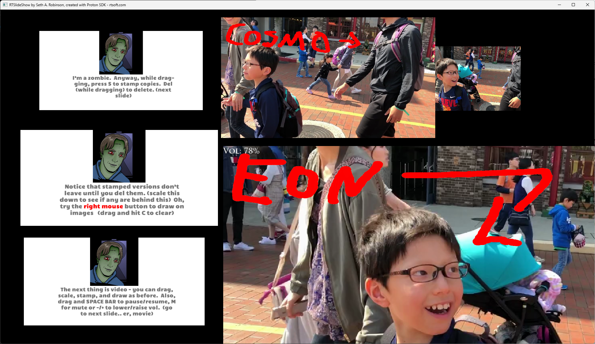

# RTSlideShow - A simple slideshow and live presentation program for pics and videos (for Windows)

This is a weird homegrown program I wrote to help me do a presentation many years ago, then to run a cafe tv kiosk that allows remote control of [audio and hue lighting](https://www.youtube.com/watch?v=_IJnD-v87TY) as well as [display custom livestream setups](https://www.youtube.com/watch?v=51EmelKS9Wk).  I then used it to [create a presentation for youtube](https://youtu.be/himk1feudIU?t=178).

It just makes it easy to move, zoom, and markup images and videos live.  Setting up a presentation is as easy as copying the files to the slides directory.  (order is determined by the filename)

Features:

* Can move/scale/copy/paste multiple images and movies (can play everything VLC can) concurrently
* Can draw on images and videos
* Use arrow keys or gamepad for prev/next slide.  Hold shift to not remove the previous slide
* Can set timer for slides to auto-change (good for kiosk type setup)
* Virtual canvas of 1080P, so positioning is still the same on different screen resolutions/window sizes
* Can display a message when a current time (like 9 PM etc) is reached

Mostly undocumented features:

* Very basic scripting system can be used to setup images, animations, display livestreams
* Can run scripts by sending a command to socket at port 8095 (the app opens this and listens)
* Can control hue lights
* Can enable on-screen clock and "now playing" song display (via text file or web browser playing via using spotify on same computer)
* Can pause/resume audio playing on foobar or spotify (that's playing in a browser on same machine) (using foobar requires beefweb component)

## Download latest version here:  https://www.rtsoft.com/files/RTSlideShow_Win64.zip (230 MB) (.exe signed by Robinson Technologies)

# How to use it

1. [Download it](https://www.rtsoft.com/files/RTSlideShow_Win64.zip), extract it somewhere, then navigate into its <b>SlideShow</b> folder.
2. To learn the basics, click <b>RunTutorialSlideShow.bat</b>.  It'll show you how to use the program.
3. Ready to make your own slideshow?  Throw some images/videos into the "slides" directory and then run <b>RTSlideShow.exe</b>.  That's it!  Oh, the order slides are shown is based on their filename.

# Keyboard shortcuts

* Alt-F4 Exit app
* Left/right arrow keys - Previous/next slide (gamepad works too)
* Shift+Left/right arrow keys - Previous/next slide without removing the previous slide
* Right mouse button - markup and draw on image or video
* [ and ] - change size of pen (note: there is no way to change the color yet.  uhhh...)
* Alt-enter - Toggle native fullscreen mode. note: you can also drag the window to resize it

Left mouse button to drag.  While dragging, you can also use the following to modify the selected image/video:

* Mouse wheel - Zoom in/out
* Space - Pause/unpause video
* -/= - Decrease/increase volume on video
* M - Mute/unmute video
* S - Stamp additional copy at the current size/position (and roughly the same location in a video)
* DEL - Delete selected image/video
* C - Clear markup on selected image/video

## How to use the scripting system

Currently undocumented.  Although I included a directory called <b>"example_scripts"</b> which shows some advanced usage.

## Remote control

It listens at port 8095 for commands that will trigger existing scripts such as ID0_ButtonA.txt, etc.  Arduino things like the M5 stick can be made to wirelessly trigger these commands.  (example code to do this in this repo's M5StickButtonArduinoCode directory) 

Oh, you can press 1 or 2 on the keyboard to fake remote button presses for testing.  They run the included ID0_ButtonA.txt and ID1_ButtonA.txt scripts which pop up a "correct" or "incorrect" graphic as well as play a sfx.

## The config file

Edit config.txt to change the default settings.  The file itself has some basic descriptions of its options.

## Comand line options

You can add -fulscreen to force fullscreen mode.  An additional parm can be the config file to use, this way many different kinds of kiosks/presentations can be ready to go from the same directory.  Example:  RTSlideShow.exe myconfig.txt

# How to compile it from source

* It's a Proton SDK project so it works like those, put this repo as a subdir of proton, ie proton/RTSlideShow
* The huestuff uses [hueplusplus](https://github.com/enwi/hueplusplus) which I've included in this repo as I think I've made a few mods
* You'll need to link to Win64 binaries of the libVLC SDK.  I can't remember if I compiled mine myself or downloaded them somewhere

Anyway, I've sort of done the minimum amount of work needed to share this little app, but if you have any questions please use the Discussions area or open an issue.  I'll try to help if I can.

# Things I should add, probably

* Add a way to change markup pen color
* Allow dragging and dropping images/videos from explorer into the app

# License

BSD style attribution, see [LICENSE.md](LICENSE.md)

# FAQ

## Q. I ran it, but it's just a blank screen?! TF??!

A. It's probably running fine, but you need to put some images or videos in the "slides" directory and restart it.  The order they are shown is based on their filename.  For a demo/tutorial, try running <b>RunTutorialSlideShow.bat</b> instead.

## Q. Does this only run on Windows?

A. Yes.  It could be ported as long as libVLC works on the target platform but meh, I only need it on Windows personally.  For now.

## Q.  My firewall popped up, are you hacking me?

A.  Nope.  The app listens at port 8095 for commands that will trigger existing RTSlideShow scripts.  It should be pretty safe even if your computer's ports were accessible from outside your network as it strips things like ../ and ..\ from the filename of the script being requested to be run, and appends ".txt".  

Even if an attacker could trigger a pre-existing script, scripts are just text files that can move SlideShow images around and stuff in the app.  It can't do anything to your computer or retrieve/send information of any kind.

If you don't need RTSlideShow scripts being run remotely, it's fine to tell Windows Firewall "no, this app can't use net stuff".  This app does not send or collect any kind of data, it's just listening for script triggers.

# Credits

Created by Seth A. Robinson

Media:  The included example video used in the "tutorial" was created by me ([it's on my junk channel](https://www.youtube.com/watch?v=EorMi4kY-28)) and the music it uses is "Urban Lullaby" from youtube's royalty free music.

Libs used:

* [Proton SDK](https://www.protonsdk.com)
* [libVLC](https://www.videolan.org/vlc/libvlc.html)
* [hueplusplus](https://github.com/enwi/hueplusplus)

